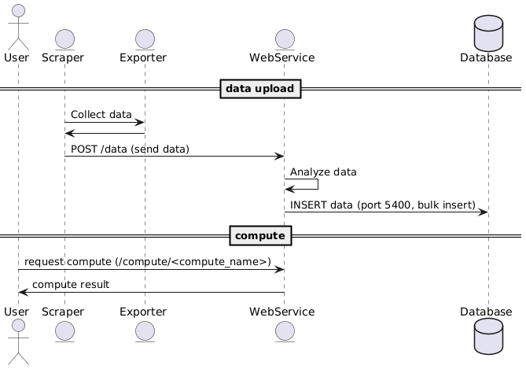

# Krateo Composable FinOps Database Handler
This service offers a set of endpoints to connect to the Krateo's CrateDB instance and use notebooks to compute data starting from SQL queries.

This service requires [CrateDB](https://github.com/crate/) to be installed in the Kubernetes cluster. The CrateDB Kubernetes operator is recommended.

For an in-depth look at the architecture and how to configure all the components, download the summary document [here](https://github.com/krateoplatformops/finops-operator-exporter/resources/Krateo_Composable_FinOps___Full.pdf).

## Summary

1. [Overview](#overview)
2. [Architecture](#architecture)
3. [API](#api)
4. [Examples](#examples)
5. [Installation](#Installation)

## Overview
This webservice acts as a proxy for all requests to the database, including the possibility of performing computations on the stored data. 
The structure is: the database requires username/password authentication for the HTTP endpoint. The password is stored in a Kubernetes secret. 
The RBAC to the secret should allow to filter who can access the webservice-database functionality. 
The handler calls the database HTTP endpoint to perform queries (both input and output). 
The result is returned by the endpoint.

## Architecture


## API
All endpoints must have the basic auth header field compiled with the username and password of the database.

- POST    `/upload`: the webservice receives the data (divided into chunks) and directly uploads it into the specified table in the database
- POST    `/compute/<compute_name>`: calls the specified compute notebook with the POST body data being the parameters required by the given algorithm, encoded in JSON as parameter_name=parameter_value
- POST    `/compute/<compute_name>/upload?overwrite=[true|false]`: uploads the specified notebook into the database with the name <compute_name>, with overwriting if configured (if not, defaults to no overwrite)
- DELETE  `/compute/<compute_name>`: deletes the specified notebook from the database
- GET     `/compute/list`: lists all available compute notebooks

The response of each endpoint will be in the format:
```json
{"result":<result message>}
```
except for the compute endpoint, which does not have a pre-defined format. This allows the output to be completely customized to the necessities of the application.

## Examples
### API
Upload endpoint:
```
curl -X POST -u <db-user>:<db-password> http://finops-database-handler.finops:8088/upload?table=<table_name>&type=<cost|resource> -d "<metrics>"
```

Compute endpoint:
```
curl -X POST -u <db-user>:<db-password> http://finops-database-handler.finops:8088/compute/cyclic \
    --header "Content-Type: application/json" \
    --data '{"table_name":"testfocus_res"}'
```

Compute endpoint upload:
```
curl -X POST -u <db-user>:<db-password> http://finops-database-handler.finops:8088/compute/cyclic/upload?overwrite=false --data-binary "@cyclic.py"
```
For notebook examples, see `./notebook_samples/cyclic.py` or `./notebook_samples/query.py`

Compute endpoint list:
```
curl -u <db-user>:<db-password> http://finops-database-handler.finops:8088/compute/list
```

Compute endpoit delete:
```
curl -X DELETE -u <db-user>:<db-password> http://finops-database-handler.finops:8088/compute/cyclic
```

### Notebooks
The notebooks are an agnostic and standalone component. They can be used to integrate additional actions in the database, including an API endpoint for data output. See the folder `notebook_sample` for examples.

The code of each notebook is injected with the authentication information to CrateDB:
```python
import sys
from crate import client
def eprint(*args, **kwargs):
    print(*args, file=sys.stderr, **kwargs)
host = sys.argv[1]
port = sys.argv[2]
username = sys.argv[3]
password = sys.argv[4]
try:
    connection = client.connect(f"http://{host}:{port}", username=username, password=password)
    cursor = connection.cursor()
except Exception as e:
    eprint('error while connecting to database' + str(e))
    raise
```
Additionally, you have to conclude the execution of your code by closing the connection and cursor:
```python
cursor.close()
connection.close()
```

To install additional dependencies inside your notebooks, you need to launch pip at runtime. For example:
```python
import pip._internal as pip
def install(package):
    pip.main(['install', package])
...
if __name__ == "__main__":
    try:
        import requests
    except ImportError:
        install('requests')
        import requests
    ...
```

### Querying the data
The Tags in the CSV data read by the exporters need to be in the following format::
```
{"CostCenter": "1234","Cost department": "Marketing","env": "prod","org": "trey","Project": "Foo"}
```
If this formatting is not used, the finops-database-handler will not insert the data into the database.
To query the data using the information present inside the tags, you can use a query like this:
```sql
SELECT resourceid
FROM "doc"."focus_table"
WHERE tags['org'] = 'test'
```

## Installation
The webservice can be installed through the [HELM chart](https://github.com/krateoplatformops/finops-database-handler-chart):
```sh
helm repo add krateo https://charts.krateo.io
helm repo update krateo
helm install finops-database-handler krateo/finops-database-handler
```

You need to configure the environment variables `CRATE_HOST` and `CRATE_PORT` in the HELM chart of the webservice to connect to the database on the HTTP endpoint of CrateDB.